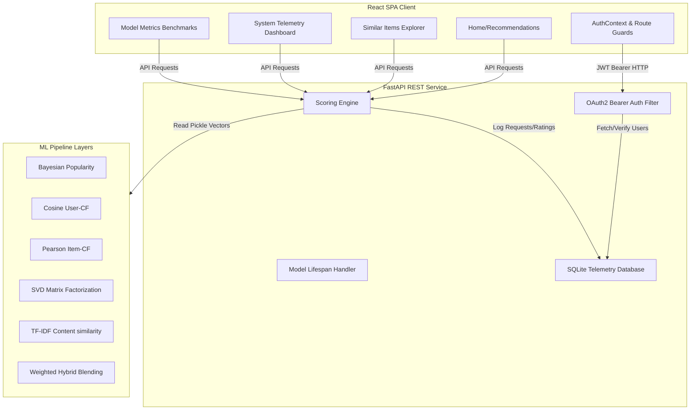

# Product Recommendation Engine

A full-stack, production-grade recommendation system built on MovieLens-100K dataset, serving personalized predictions via a secure FastAPI backend to a Vite + React SPA client.

---

## 1. System Architecture



---

## 2. Directory Structure & Folder Explanation

```
workspace/
├── pyrightconfig.json        # Pyright path resolver for IDE imports
├── docker-compose.yml        # Unified Multi-container Compose configuration
├── developer_docs.md         # Local setup guide
├── README.md                 # This manual
├── backend/                  # Python REST API & ML training package
│   ├── api/                  # FastAPI web server and database logs
│   │   ├── __init__.py
│   │   ├── main.py           # REST endpoints, CORS, database logger
│   │   ├── database.py       # SQLAlchemy engines, tables, sessions
│   │   ├── schemas.py        # Pydantic schemas (V2 compliant)
│   │   ├── model_loader.py   # Model cache & high-performance scoring
│   │   └── auth.py           # Password hashing & JWT token operations
│   ├── data/                 # Raw/preprocessed MovieLens CSVs and DB
│   ├── models/               # Pickle (.pkl) models and evaluation benchmark
│   ├── scripts/              # ML training scripts (01_eda.py to 08_evaluation.py)
│   ├── tests/                # Automated pytest suites
│   │   ├── test_api.py       # API router and DB logger assertions
│   │   └── test_models.py    # Cosine bounds and hybrid logic assertions
│   └── requirements.txt      # Python dependencies
└── frontend/                 # React Single Page Application (SPA)
    ├── package.json          # Node dependencies
    ├── vite.config.js        # Vite compilation and proxy mapping
    ├── index.html            # Entry HTML mounting script
    ├── nginx.conf            # Nginx config for client SPA fallback routing
    ├── Dockerfile            # Multi-stage frontend Docker compiler and server
    └── src/                  # React source files
        ├── main.jsx          # React mount entrypoint
        ├── App.jsx           # Layout routes
        ├── index.css         # Reset and global styles
        ├── context/          # Auth state provider
        ├── components/       # UI cards, badges, ProtectedRoute guard
        ├── pages/            # Home, Similar, Dashboard, Analytics, About
        └── services/         # Axios / API fetchers
```

---

## 3. Local Installation Guide

### Prerequisites
- Python 3.10+
- Node.js 18+

### Setup Virtual Environment & Dependencies
1. Navigate to the project root and create a virtual environment:
   ```bash
   python -m venv .venv
   .venv\Scripts\activate      # Windows Powershell/CMD
   # or: source .venv/bin/activate (Linux/Mac)
   ```
2. Upgrade pip and install build dependencies:
   ```bash
   pip install --upgrade pip
   pip install wheel setuptools
   ```
3. Install dependencies:
   ```bash
   pip install scikit-surprise==1.1.5
   pip install -r backend/requirements.txt
   ```

### Run the Backend REST Service
```bash
cd backend
..\.venv\Scripts\python -m uvicorn api.main:app --port 8000 --reload
```
The server will boot at `http://127.0.0.1:8000`. You can inspect the Swagger interactive documentation at `http://127.0.0.1:8000/docs`.

### Run the Frontend Client SPA
1. Navigate to the `frontend/` directory and install dependencies:
   ```bash
   cd frontend
   npm install
   ```
2. Boot the Vite development server:
   ```bash
   npm run dev
   ```
The client SPA will boot at `http://localhost:5173`. Calls to `/api/*` are automatically proxied to the local backend port `8000`.

---

## 4. One-Command Docker Deployment

You can launch the entire secured stack (FastAPI backend + React frontend + SQLite DB) using Docker Compose:
```bash
# Run from the project root:
docker-compose up --build
```
- **React Frontend SPA**: `http://localhost:3000`
- **FastAPI Backend Server**: `http://localhost:8000/docs`

---

## 5. API Documentation

### Authentication Scopes
| Method | Endpoint | Auth | Request Body | Description |
| :--- | :--- | :--- | :--- | :--- |
| `POST` | `/auth/register` | Public | `UserRegister` | Create a new user credentials record |
| `POST` | `/auth/login` | Public | `UserLogin` | Validate credentials, returns a JWT token |
| `GET` | `/health` | Public | None | Health status, loaded models, dataset stats |
| `GET` | `/items` | Public | None | Browse item catalogue |
| `GET` | `/users` | Public | None | Get valid user IDs |
| `GET` | `/recommend/{user_id}` | Protected | None | Returns Top-K recommendations for a user |
| `GET` | `/similar/{item_id}` | Public | None | Similar items by genre TF-IDF similarity |
| `POST` | `/rate` | Protected | `RateRequest` | Logs user rating telemetry |
| `GET` | `/analytics/summary` | Protected | None | Fetches aggregated request telemetry |
| `GET` | `/logs/ratings` | Protected | None | Lists submitted ratings log history |

---

## 6. Machine Learning Models & Metrics

The system implements 5 models, benchmarking their accuracy on the held-out test split:

| Model | RMSE (lower is better) | MAE (lower is better) | Precision@10 (higher is better) | Recall@10 (higher is better) | NDCG@10 (higher is better) |
| :--- | :---: | :---: | :---: | :---: | :---: |
| **Popularity Baseline** | 1.0239 | 0.8128 | 0.0970 | 0.0630 | — |
| **User-based CF** | 0.9519 | 0.7500 | 0.0120 | 0.0163 | — |
| **Item-based CF** | 0.9430 | 0.7365 | 0.0160 | 0.0106 | — |
| **SVD (tuned)** | 0.9249 | 0.7276 | 0.0832 | 0.0616 | 0.1010 |
| **Content-Based** | — | — | 0.0174 | 0.0141 | 0.0212 |
| **Hybrid ★** | 1.1720 | 0.9859 | 0.0808 | 0.0630 | **0.1057** |

### Algorithmic Highlights
- **Weighted Blending**: Hybrid combines SVD matrix predictions ($60\%$) and content genre similarity ($40\%$) to optimize movie rankings.
- **Cold Start Handling**: If a user has $<3$ historical ratings in the training data, SVD is bypassed and recommendations fallback to content-only mode.

---

## 7. Future Improvements
1. **Dynamic Alpha Blending**: Adjust SVD/Content weighting dynamically based on user profile length.
2. **Deep Learning Frameworks**: Integrate Neural Collaborative Filtering (NCF) or sequential GRU/BERT4Rec models.
3. **Write-Optimized Databases**: Scale logs storage from SQLite to PostgreSQL or Redis caching for high concurrency throughput.
